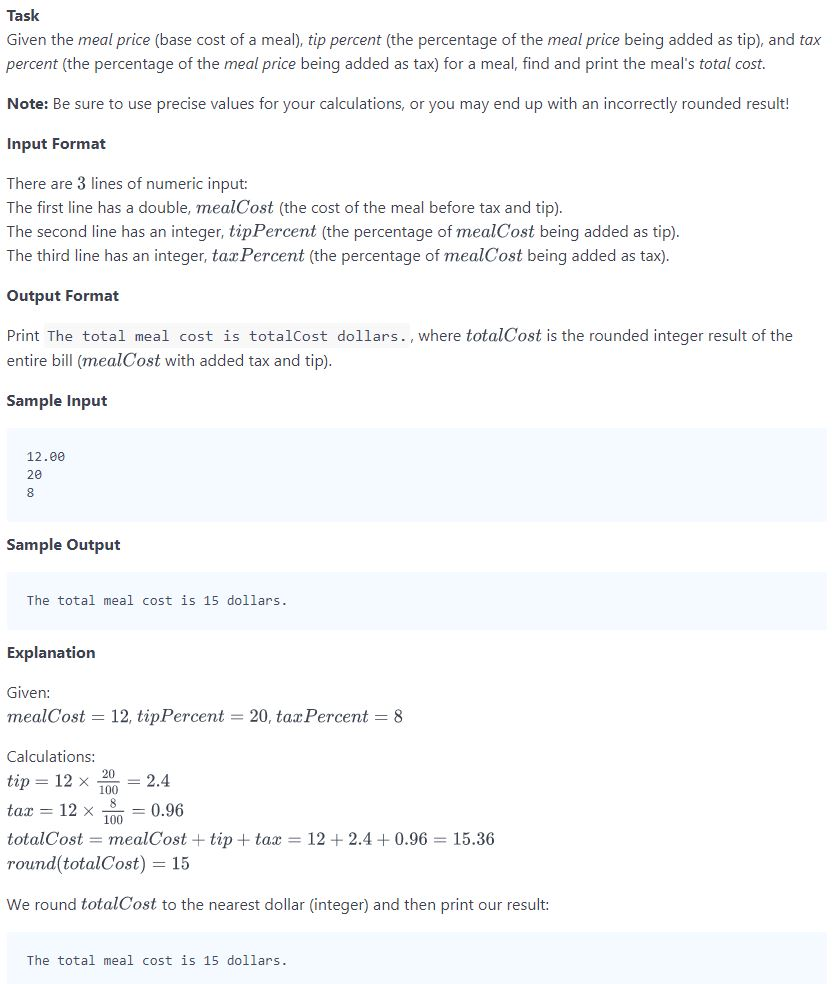

## Problem


## Source
```python
# -*- coding: utf-8 -*-
#!/usr/bin/python

import sys

if __name__ == "__main__":
    meal_cost = float(input().strip())
    tip_percent = int(input().strip())
    tax_percent = int(input().strip())

    total_cost = meal_cost + (meal_cost * (tip_percent*0.01)) + (meal_cost * (tax_percent*0.01))
    print("The total meal cost is %d dollars." % int(round(total_cost)))
```

## Solution
```python
def get_total_cost_of_meal():
    # original meal price
    meal_cost = float(input())
    # tip percentage
    tip_percent = int(input())
    # tax percentage
    tax_percent = int(input())

    # Write your calculation code here
    tip = meal_cost * tip_percent / 100
    tax = meal_cost * tax_percent / 100

    # cast the result of the rounding operation to an int and save it as total_cost 
    total_cost = int(round(meal_cost + tax + tip))
    
    return str(total_cost)

# Print your result
print("The total meal cost is " + get_total_cost_of_meal() + " dollars.")
```

## Reference
* https://www.hackerrank.com/challenges/30-operators/problem
* https://www.hackerrank.com/challenges/30-operators/editorial

