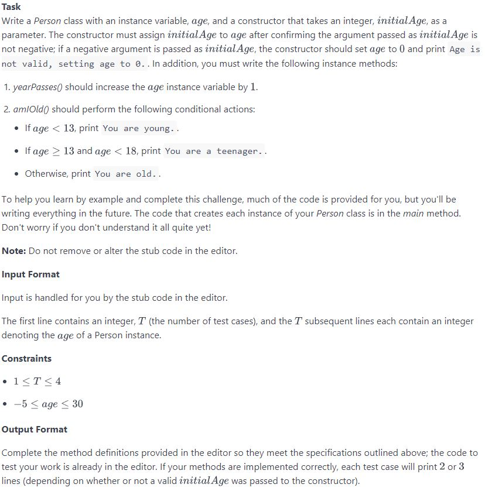
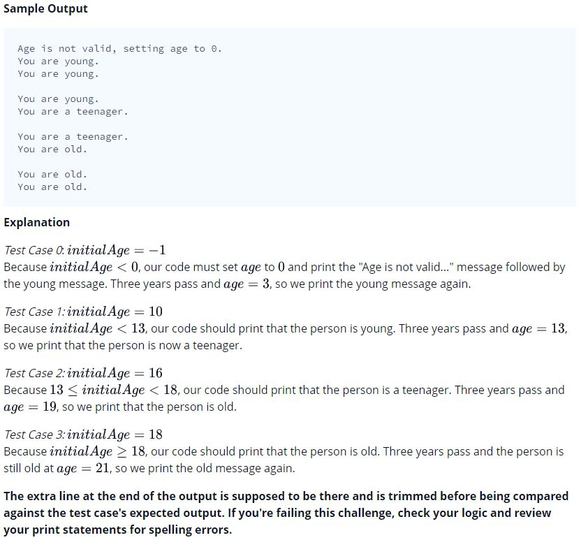

## Problem



## Source
```python
# -*- coding: utf-8 -*-
#!/usr/bin/python

import sys

class Person:
    age = 0

    def __init__(self, initialAge):
        # Add some more code to run some checks on initialAge
        self.age = initialAge

    def amIOld(self):
        # Do some computations in here and print out the correct statement to the console
        if self.age < 0:
            self.age = 0
            print("Age is not valid, setting age to 0.")
        if self.age < 13:
            print("You are young.")
        elif self.age >= 13 and self.age < 18:
            print("You are a teenager.")
        else:
            print("You are old.")

    def yearPasses(self):
        # Increment the age of the person in here
        self.age += 1


if __name__ == '__main__':
    t = int(input())
    for i in range(0, t):
        age = int(input())
        p = Person(age)
        p.amIOld()
        for j in range(0, 3):
            p.yearPasses()
        p.amIOld()
        print("")
```

## Solution
```python
class Person:
    def __init__(self, initialAge):
        if(initialAge < 0):
            print("Age is not valid, setting age to 0.")
            self.age = 0
        else:
            self.age = initialAge
            
    def amIOld(self):
        if self.age >= 18:
            print("You are old.")
        elif self.age >= 13:
            print("You are a teenager.")
        else: # age < 13
            print("You are young.")
            
    def yearPasses(self):
        self.age += 1
```

## Reference
* https://www.hackerrank.com/challenges/30-class-vs-instance/problem
* https://www.hackerrank.com/challenges/30-class-vs-instance/editorial
