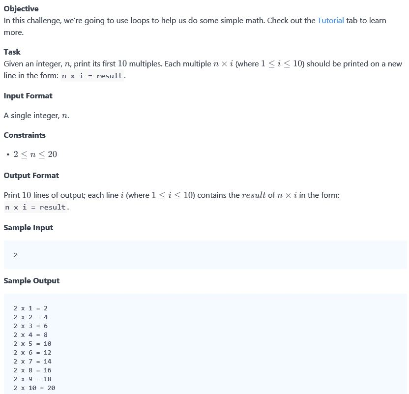

## Problem


## Source
```python

# -*- coding: utf-8 -*-
#!/usr/bin/python

import sys

n = int(input().strip())

for i in range (1, 11):
    print("%d x %d = %d" %(n, i, n*i))
```

## Solution
```python
N = int(raw_input().strip())
for i in range(1, 10 + 1):
    print N, "x", i, "=", N*i
```

## Reference
* https://www.hackerrank.com/challenges/30-loops/problem
* https://www.hackerrank.com/challenges/30-loops/editorial
