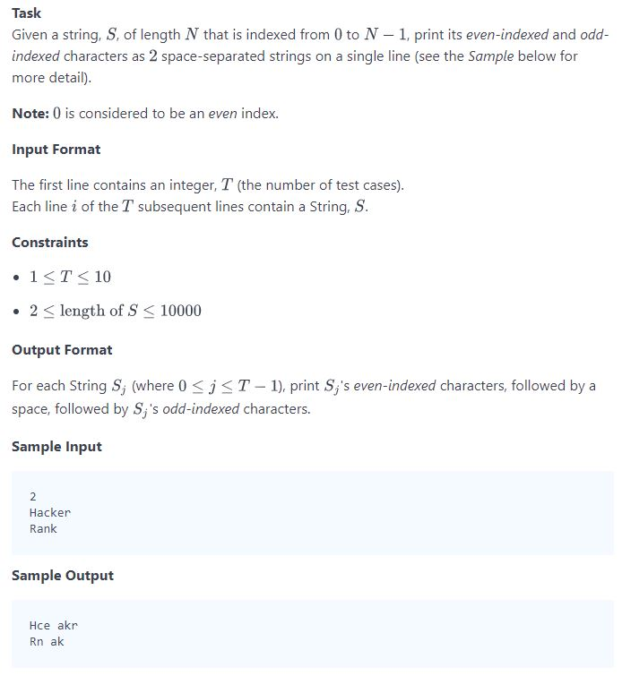
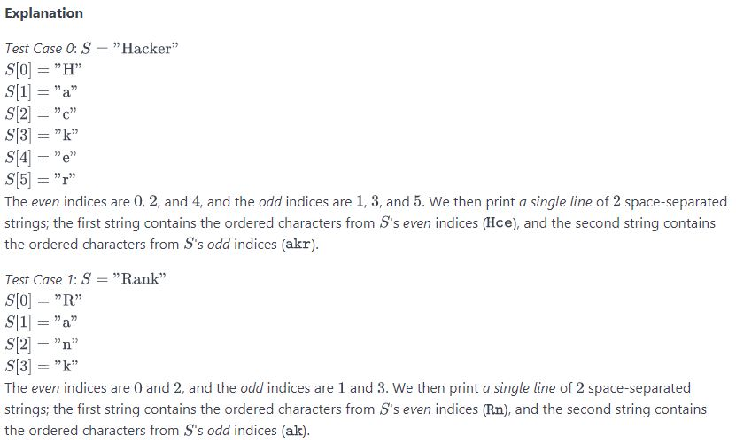

## Problem



## Source
```python
# -*- coding: utf-8 -*-
#!/usr/bin/python

import sys

n = int(input().strip())

for i in range (n):
    input_string = input()
    even_str = ""
    odd_str = ""

    for j, value in enumerate(input_string):
        if (j % 2 == 0):
            even_str += value
        else:
            odd_str += value

    print("%s %s" % (even_str, odd_str))
```

## Solution
```python
t = int(raw_input())
for _ in range(t):
    line = raw_input()
    first = ""
    second = ""

    for i, c in enumerate(line):
        if (i & 1) == 0:
            first += c
        else:
            second += c
    print first, second
```

## Reference
* https://www.hackerrank.com/challenges/30-review-loop/problem
* https://www.hackerrank.com/challenges/30-review-loop/editorial
