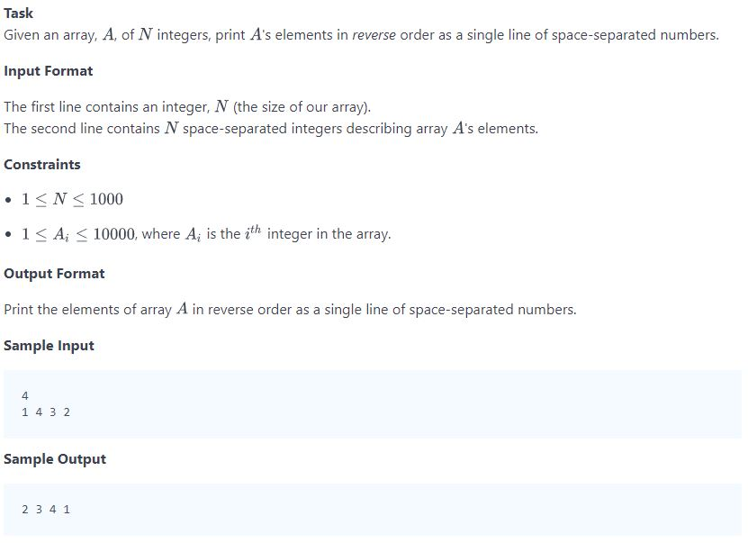

## Problem


## Source
```python
import sys

n = int(input().strip())
arr = [int(arr_temp) for arr_temp in input().strip().split(' ')]

for i in range(len(arr)-1, -1, -1):
    print(arr[i], end=" ")
```

## Solution
```python
import sys

n = int(input().strip())
arr = [int(arr_temp) for arr_temp in input().strip().split(' ')]
print(' '.join(str(x) for x in arr[::-1]))
```

## Reference
* https://www.hackerrank.com/challenges/30-arrays/problem
* https://www.hackerrank.com/challenges/30-arrays/editorial
