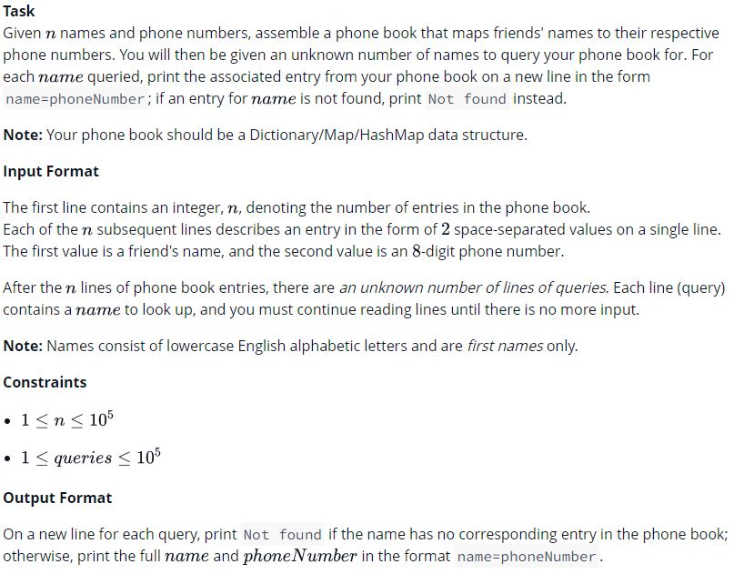
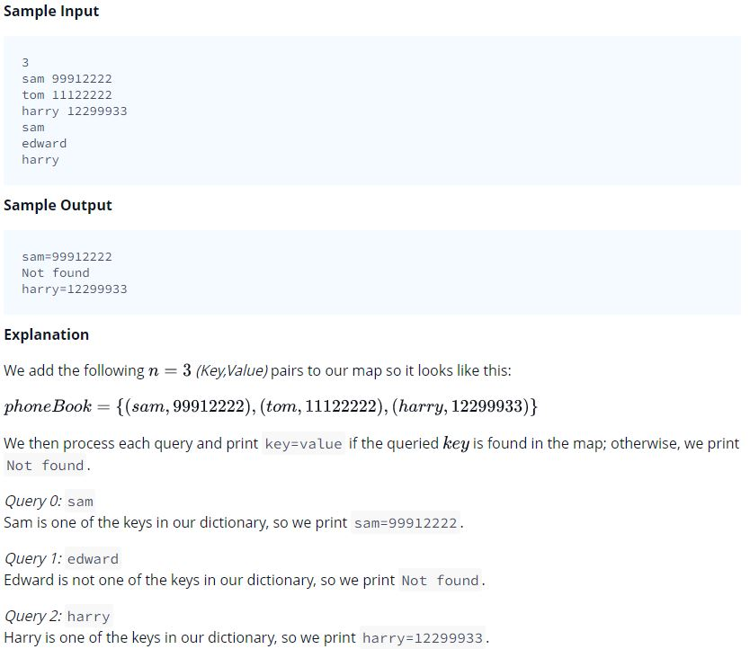

## Problem



## Source
```python
import sys

n = int(input())
name_numbers = [input().split() for _ in range(n)]
phone_book = {k: v for k,v in name_numbers}

while True:
    try:
        name = input()
        if name in phone_book:
             print('%s=%s' % (name, phone_book[name]))
        else:
            print('Not found')
    except:
        break
```

## Solution
```python
import sys 

# Read input and assemble Phone Book
n = int(input())
phoneBook = {}
for i in range(n):
    contact = input().split(' ')
    phoneBook[contact[0]] = contact[1]

# Process Queries
lines = sys.stdin.readlines()
for i in lines:
    name = i.strip()
    if name in phoneBook:
        print(name + '=' + str( phoneBook[name] ))
    else:
        print('Not found')
```

## Reference
* https://www.hackerrank.com/challenges/30-dictionaries-and-maps/problem
* https://www.hackerrank.com/challenges/30-dictionaries-and-maps/editorial
