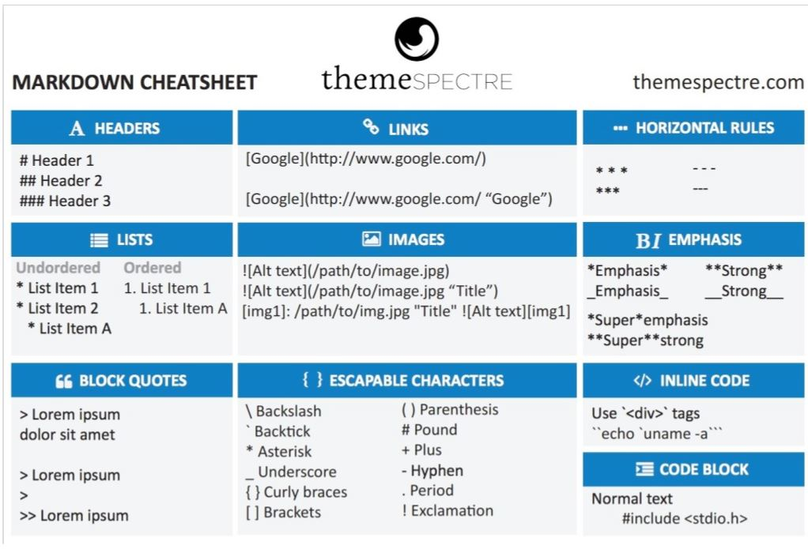
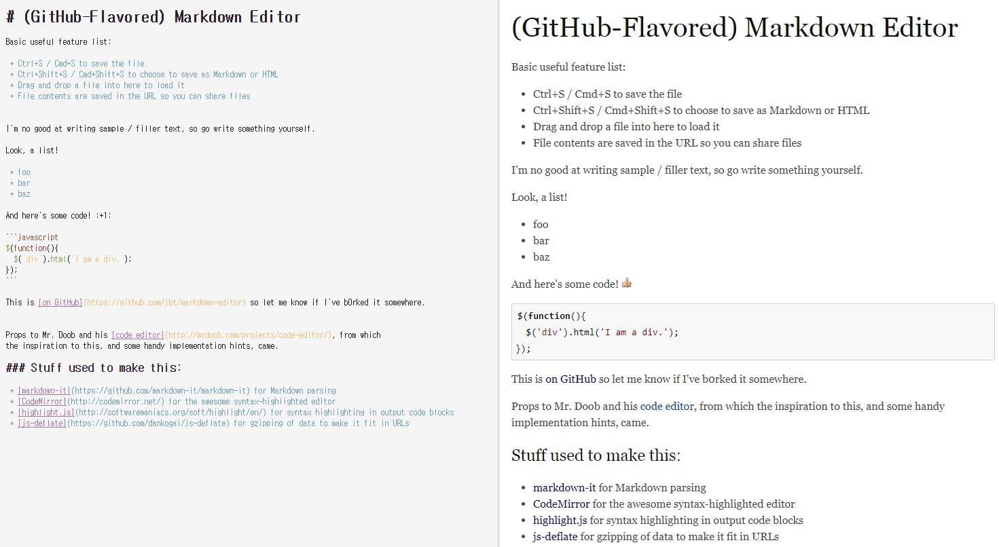

# markdown 작성법

markdown 작성에 필요한 정보를 정리해보았습니다.
 
## markdown cheat sheet

## markdown example

## Reference
* [markdown-editor] https://jbt.github.io/markdown-editor/
* [markdown cheat sheet] https://guides.co/g/getting-started-with-ghost/8885
* [example1] https://github.com/biospin/BigBio/blob/master/reference/%EB%A7%88%ED%81%AC%EB%8B%A4%EC%9A%B4.md
* [example2] https://simhyejin.github.io/2016/06/30/Markdown-syntax/
* [example3]https://gist.github.com/ihoneymon/652be052a0727ad59601
