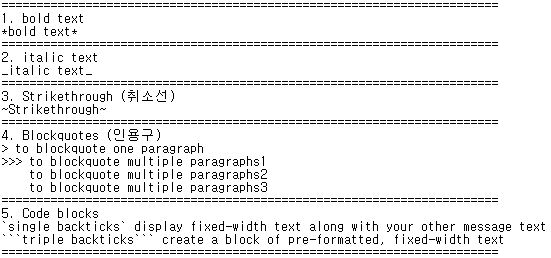
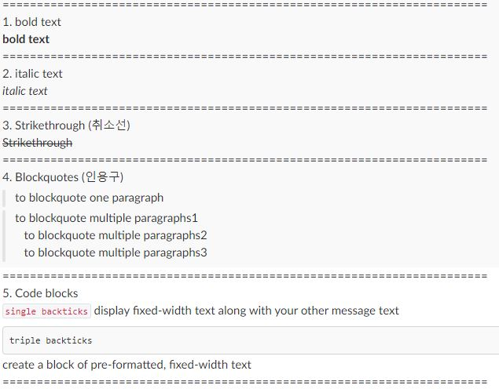

slack에서 사용하는 메시지 포맷을 정리했습니다.

## slack message format

## slack message result

## Reference
* https://api.slack.com/docs/message-formatting
* https://get.slack.help/hc/en-us/articles/202288908-how-can-i-add-formatting-to-my-messages-
